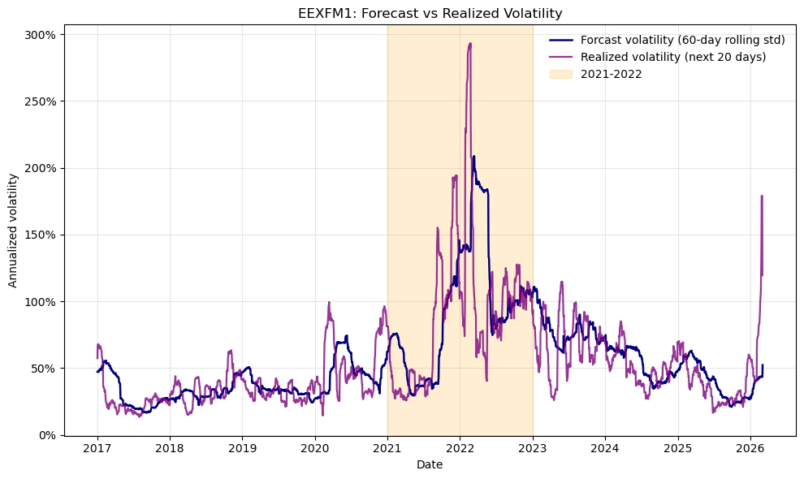
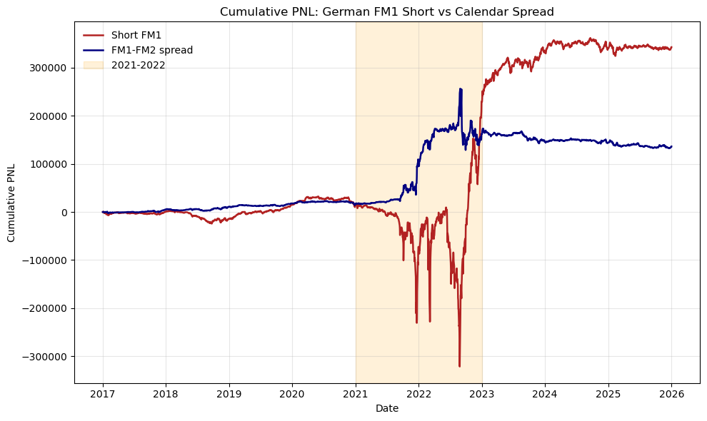
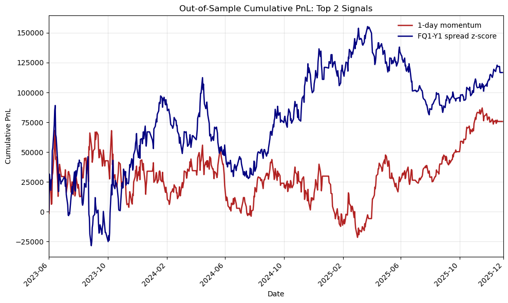
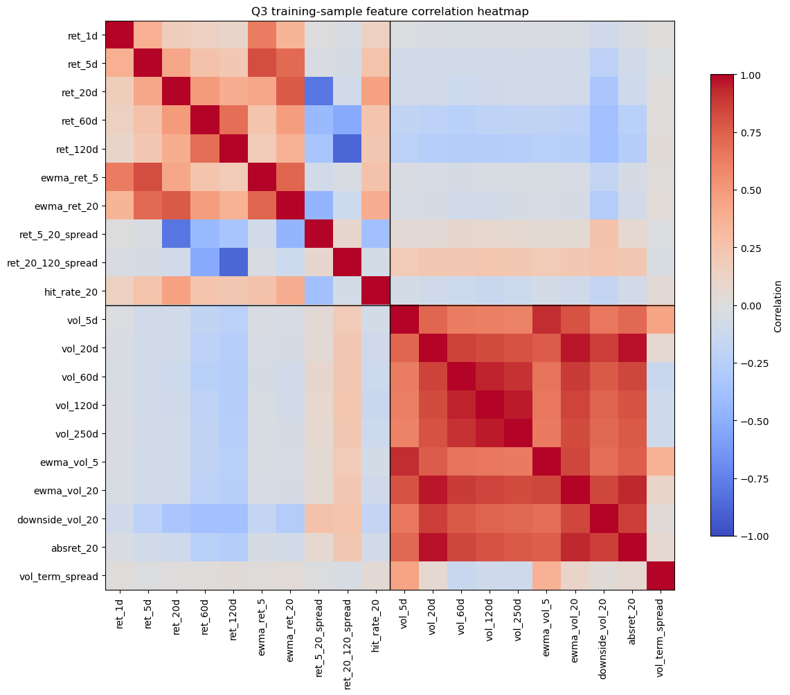

# EEX Power Futures Analysis

This repository is a quantitative finance project built in Python on EEX German power futures data. The analysis turns raw contract-level market data into a reproducible workflow for volatility modeling, signal design, strategy backtesting, and derivative pricing.

The project uses 91,967 observations spanning 2006-01-02 to 2026-03-04, covering 18 contract IDs and 702 symbols. It is notebook-first, but the work is structured around reusable helper functions for data cleaning, feature engineering, evaluation, and pricing.

## Project Highlights

- Cleaned and transformed futures data with `pandas`, including roll-aware price-change handling
- Measured distribution properties with skewness, kurtosis, and Jarque-Bera diagnostics
- Compared rolling volatility estimators and selected a 60-day forecast proxy
- Built and evaluated outright and calendar-spread PnL series
- Engineered directional and relative-value trading signals from price and spread behavior
- Constructed a 20-feature cross-sectional modeling pipeline and fit ridge regression
- Implemented Black-76 option pricing and hedge PnL decomposition

## What Employers Can See Here

- Practical time-series data wrangling on nontrivial market data
- Clear use of statistical diagnostics instead of ad hoc conclusions
- End-to-end thinking: data prep, modeling, evaluation, and interpretation
- Applied derivatives knowledge, not just generic machine learning
- Communication of results through figures, report output, and presentation material

## Repository Guide

- `GRA6561_1026202.ipynb`: main analysis notebook
- `GRA6561_1026202.pdf`: exported write-up
- `midterm_presentation.pptx`: presentation deck
- `GRA65612_data.csv`: source futures dataset
- `figures/`: charts produced during the analysis

## Technical Stack

- Python 3.13
- pandas
- numpy
- matplotlib
- scipy
- Jupyter Notebook

## Selected Outputs

### Volatility Forecasting



### Outright vs Calendar Spread PnL



### Signal Backtest



### Feature Correlation



## Reproducing The Analysis

```bash
python3 -m venv .venv
source .venv/bin/activate
pip install -r requirements.txt
jupyter notebook GRA6561_1026202.ipynb
```

## Notes

This repository is presented as a portfolio project from coursework in quantitative analysis. The value of the project is not the assignment itself, but the evidence of practical work in market data analysis, signal research, backtesting, and derivatives modeling.
